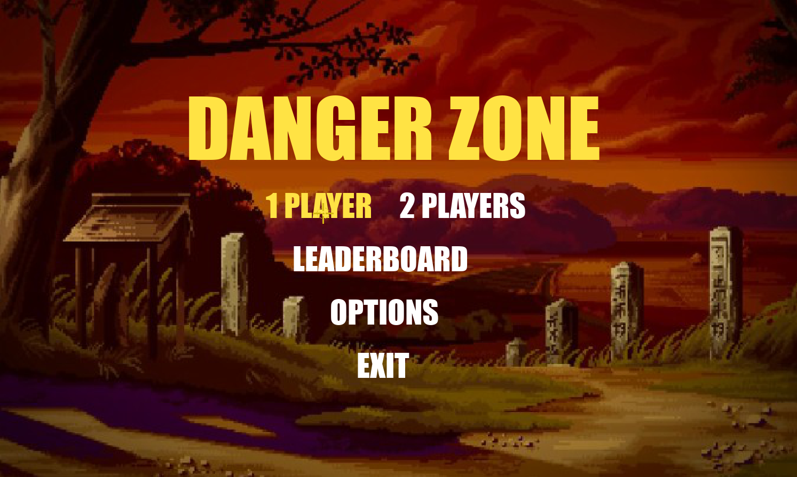
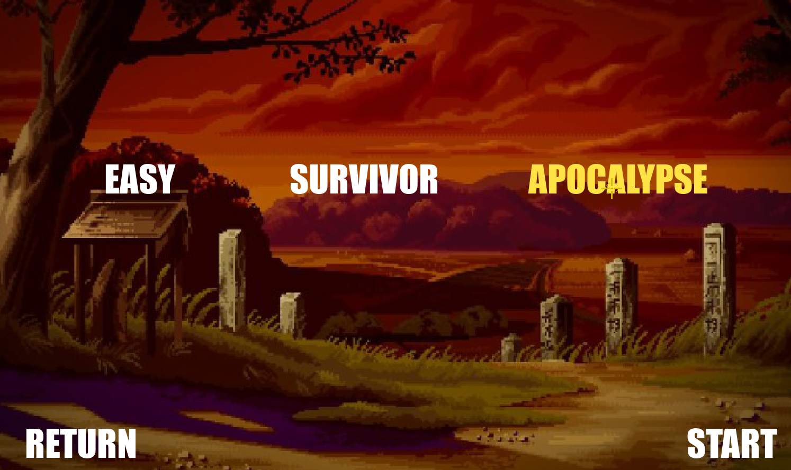
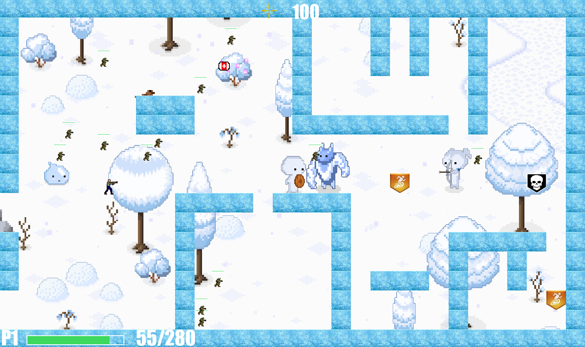
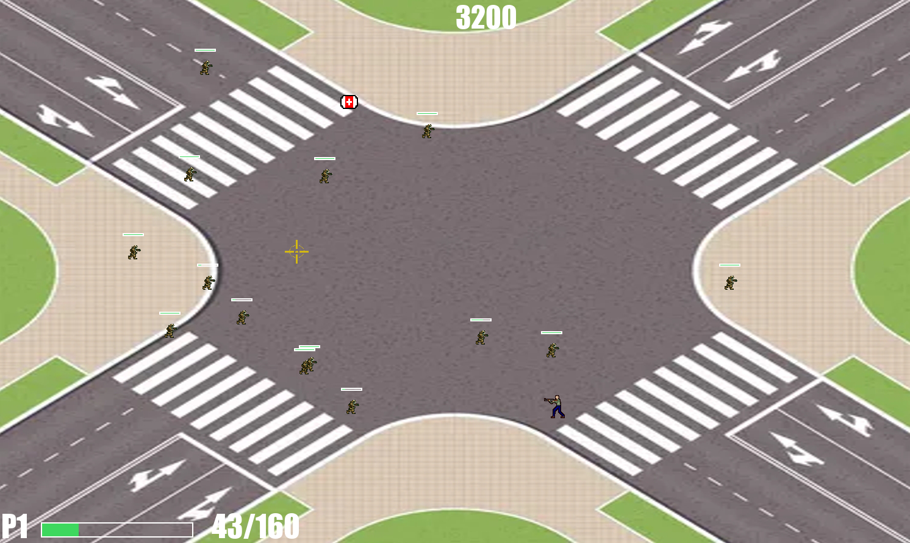

# Danger Zone

This game is a classic game of zombies created by students of Computer Science, using a library called pygame.

## Requirements
* Python 3.9 or later

## Deploy

1. Clone the repository
2. Install pygame with ```pip install pygame```

# Images in game







This game was created by the followings developers:

* Renato Cernades
* Max Ántunez
* Joaquín Galvez
* Enzo Camizán
* Alexandro Chamochumbi